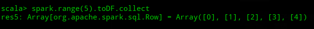
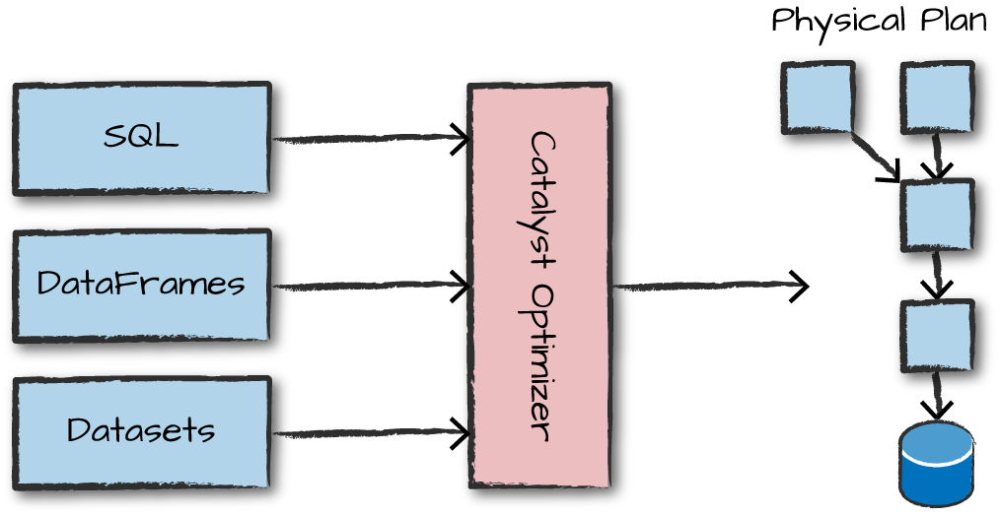
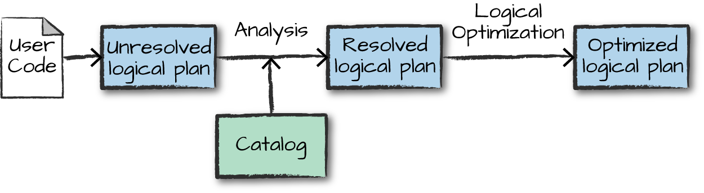
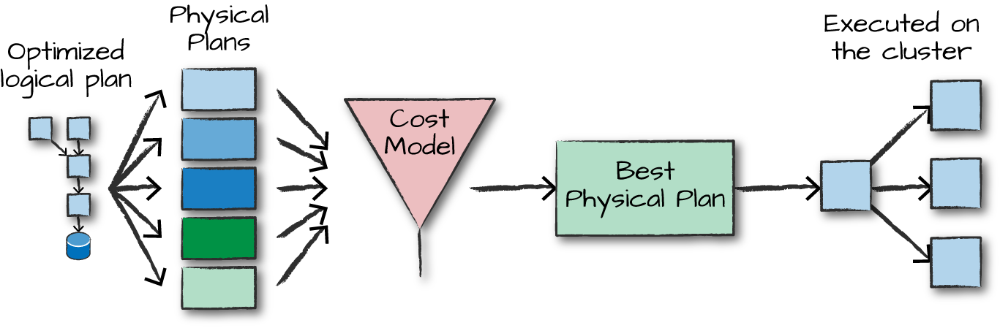

# Chapter 4：结构化API预览
这章开头就谈及会深入讲解一下 Spark 的结构化 API（Structured APIs），具体又分为三种核心类型的分布式集合API——Datasets、DataFrames、SQL tables and views，这些APIs用来处理各种数据——非结构化的日志、半结构化的csv文件和高度结构化的Parquet文件。

DataFrame早期是叫SchemaRDD，spark 1.3之后改进为df，可见df就是加上了Schema的RDD，但又进一步提升了执行效率，减少了数据读取（针对一些特别的数据格式，像ORC、RCFile、Parquet，可以根据数据文件中附带的统计信息来进行选择性读取）以及优化了执行计划（就是前面谈过的逻辑计划的优化）。

spark 1.6引入了DataSet，DataFrame=DataSet[Row]，DataSet可以看成一条记录的df的特例，主要区别是Dataset每一个record存储的是一个强类型值而不是一个Row，其次DataSet完全是面向对象的使用相关RDD算子编程

DataFrame->DataSet：`df.as[ElementType]`
DataSet->DataFrame：`ds.toDF(colName)`

> 参考：https://www.jianshu.com/p/c0181667daa0


RDD：
	java/scala->运行在jvm上
	python->运行在python运行环境上
	（所以不同语言运行spark程序效率可能不同）
DataFrame：
	java/scala/python->转换为logical plan，运行效率是一样的
	DataFrame相比RDD还有更高级的API

## Datasets

## DataFrames

### Columns 列
你可以简单看作DataFrame中的列，它可以是一个简单类型（integer、string），也可以是复杂类型（array、map），或者是null

### Rows 行
Row就是DataFrame中的一行记录，如图显示的Row类型


## Spark Types（Spark内置类型）
很好理解就是SPark将通常讲的哪些Integer、String给包装成了内置类型IntegerType、StringType，只要记住都在`org.apache.spark.sql.types`包下，如下是scala中申明字节类型
```scala
import org.apache.spark.sql.types._
val b = ByteType
```
看书看到这里你可能会不清楚这个Spark Type有啥用，其实在大致浏览过一篇会发现在RDD转DataFrame时会用到这个Spark Type，记着就是了

## 结构化API执行流程预览
总的来说分如下几步：
1. 写出正确的 DataFrame/Dataset/SQL 代码
2. 如果代码没错，spark会把它转化为逻辑执行计划
3. spark 将逻辑计划进行优化，并转化为物理执行计划
4. spark在集群上执行这个物理计划（基于系列RDD操作）

<div align=center></div>

理解这个有助于编码和调试bug，Catalyst Optimizer（优化器）Catalyst是上面说过的Spark SQL引擎，具体的流程如下

### 逻辑计划
<div align=center></div>
如图，是将代码转化为逻辑执行计划的流程，这只是抽象的转化不涉及Executor（执行器）和Driver（驱动程序）。首先，把你写的代码转换成 unresolved logical plan（未解决的逻辑计划），因为代码中可能会有不存在的表名、列名。然后通过catalog来解析（resolve）分析器中的列和表，这里的catalog存储了所有的表和DataFrame的信息。如果代码中有不存在的表名、列名，分析器会拒绝 unresolved logical plan，反之成为 resolved logical plan（解决的逻辑计划）交付给 Catalyst Optimizer 进行优化。Catalyst Optimizer 是一组规则的集合，通过谓词下推（pushing down predicates）或者投影（selections）来尝试优化逻辑计划。

### 物理计划
<div align=center></div>

如图，成功转化为逻辑执行计划后就开始转化为物理计划了，spark会尝试生成多个不同的物理计划，然后通过一个代价模型（cost model）来比较开销成本，从中选出最优的一个物理计划在集群上运行。书上给了一个代价比较的例子：通过查看所给表的物理属性，比如表的大小、分区的大小。
最终物理计划的结果是一些列RDDs和transformations（我的理解是转换操作，对应转换算子）。

### 执行
在选择了物理计划时，spark通过底层（lower-level）编程接口也运行了这些基于RDDs的代码，运行时还会进一步优化，生成本地的java字节码，可以在执行阶段移除整个tasks和stages（没搞懂这说的是啥），最终返回结果给你。