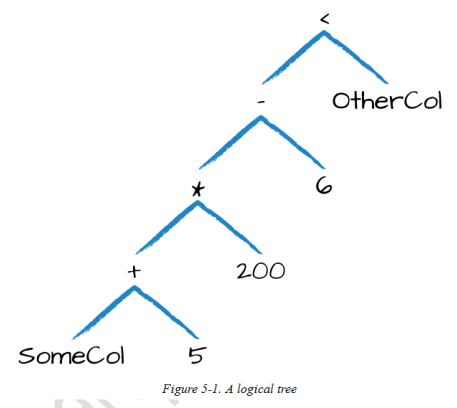
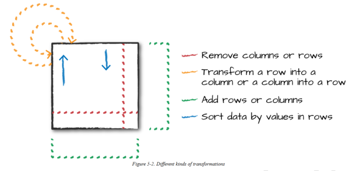
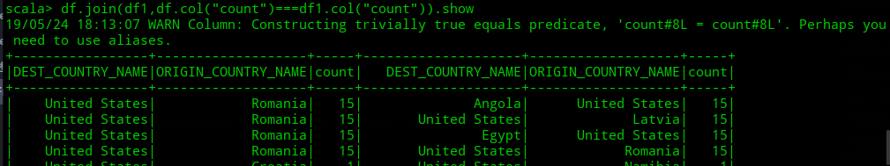
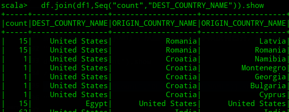

# Chapter 5：基本结构化API操作

## Schemas (模式)

我这里使用的是书附带的数据源中的 `2015-summary.csv` 数据
```scala
scala> val df = spark.read.format("csv").option("header","true").option("inferSchema","true").load("data/2015-summary.csv")
df: org.apache.spark.sql.DataFrame = [DEST_COUNTRY_NAME: string, ORIGIN_COUNTRY_NAME: string ... 1 more field]

scala> df.printSchema
root
 |-- DEST_COUNTRY_NAME: string (nullable = true)
 |-- ORIGIN_COUNTRY_NAME: string (nullable = true)
 |-- count: integer (nullable = true)
```
通过printSchema方法打印df的Schema。这里Schema的构造有两种方式，一是像上面一样读取数据时根据数据类型推断出Schema（schema-on-read），二是自定义Schema。具体选哪种要看你实际应用场景，如果你不知道输入数据的格式，那就采用自推断的。相反，如果知道或者在ETL清洗数据时就应该自定义Schema，因为Schema推断会根据读入数据格式的改变而改变。

看下Schema具体是什么，如下输出可知自定义Schema要定义包含StructType和StructField两种类型的字段，每个字段又包含字段名、类型、是否为null或缺失
```scala
scala> spark.read.format("csv").load("data/2015-summary.csv").schema
res1: org.apache.spark.sql.types.StructType = StructType(StructField(DEST_COUNTRY_NAME,StringType,true), StructField(ORIGIN_COUNTRY_NAME,StringType,true), StructField(count,IntegerType,true))
```

一个自定义Schema的例子，具体就是先引入相关类`StructType`,`StructField`和相应内置数据类型（Chapter 4中提及的Spark Type），然后定义自己的Schema，最后就是读入数据是通过schema方法指定自己定义的Schema
```scala
scala> import org.apache.spark.sql.types.{StructType,StructField,StringType,LongType}
import org.apache.spark.sql.types.{StructType, StructField, StringType, LongType}

scala> val mySchema = StructType(Array(
     |  StructField("DEST_COUNTRY_NAME",StringType,true),
     |  StructField("ORIGIN_COUNTRY_NAME",StringType,true),
     |  StructField("count",LongType,true)
     | ))
mySchema: org.apache.spark.sql.types.StructType = StructType(StructField(DEST_COUNTRY_NAME,StringType,true), StructField(ORIGIN_COUNTRY_NAME,StringType,true), StructField(count,LongType,true))

scala> val df = spark.read.format("csv").schema(mySchema).load("data/2015-summary.csv")
df: org.apache.spark.sql.DataFrame = [DEST_COUNTRY_NAME: string, ORIGIN_COUNTRY_NAME: string ... 1 more field]

scala> df.printSchema
root
 |-- DEST_COUNTRY_NAME: string (nullable = true)
 |-- ORIGIN_COUNTRY_NAME: string (nullable = true)
 |-- count: long (nullable = true)
```

看这里StringType、LongType，其实就是Chapter 4中谈过的Spark Type。还有就是上面自定义Schema真正用来的是把RDD转换为DataFrame，[参见之前的笔记](https://github.com/josonle/Learning-Spark/blob/master/notes/LearningSpark(8)RDD%E5%A6%82%E4%BD%95%E8%BD%AC%E5%8C%96%E4%B8%BADataFrame.md#%E6%96%B9%E6%B3%95%E4%BA%8C%E5%9F%BA%E4%BA%8E%E7%BC%96%E7%A8%8B%E6%96%B9%E5%BC%8F)

## Columns(列) 和 Expressions(表达式)
书提及这里我觉得讲得过多了，其实质就是告诉你在spark sql中如何引用一列。下面列出这些
```scala
df.select("count").show
df.select(df("count")).show
df.select(df.col("count")).show #col方法可用column替换，可省略df直接使用col
df.select($"count").show #scala独有的特性，但性能没有改进，了解即可（书上还提到了符号`'`也可以，如`'count`）
df.select(expr("count")).show
df.select(expr("count"),expr("count")+1 as "count+1").show(5) #as是取别名
df.select(expr("count+1")+1).show(5)
df.select(col("count")+1).show(5)
```
大致就上面这些了，主要是注意col和expr方法，二者的区别是expr可以直接把一个表达式的字符串作为参数，即`expr("count+1")`等同于`expr("count")+1`、`expr("count")+1`

> 多提一句，SQL中`select * from xxx`在spark sql中可以这样写`df.select("*")/df.select(expr("*"))/df.select(col("*"))`

书中这一块还讲了为啥上面这三个式子相同，spark会把它们编译成相同的语法逻辑树，逻辑树的执行顺序相同。编译原理学过吧，自上而下的语法分析，LL(1)自左推导
比如 `(((col("someCol") + 5) * 200) - 6) < col("otherCol")` 对应的逻辑树如下


## Records(记录) 和 Rows(行)

Chapter 4中谈过`DataFrame=DataSet[Row]`，DataFrame中的一行记录（Record）就是一个Row类型的对象。Spark 使用列表达式 expression 操作 Row 对象,以产生有效的结果值。Row 对象的内部表示为:字节数组。因为我们使用列表达式操作 Row 对象,所以,字节数据不会对最终用户展示（用户不可见）

我们来自定义一个Row对象
```scala
scala> import org.apache.spark.sql.Row
import org.apache.spark.sql.Row

scala> val myRow = Row("China",null,1,true)
myRow: org.apache.spark.sql.Row = [China,null,1,true]
```
首先要引入Row这个类，然后根据你的需要（对应指定的Schema）指定列的值和位置。为啥说是对应Schema呢？明确一点，DataFrame才有Schema，Row没有，你之所以定义一个Row对象，不就是为了转成DataFrame吗（后续可见将RDD转为DataFrame），不然RDD不能用吗非得转成Row，对吧。

访问Row对象中的数据
```scala
scala> myRow(0)
res12: Any = China

scala> myRow.get
get          getByte    getDecimal   getInt       getLong   getShort    getTimestamp   
getAs        getClass   getDouble    getJavaMap   getMap    getString   getValuesMap   
getBoolean   getDate    getFloat     getList      getSeq    getStruct                  

scala> myRow.get(1)
res13: Any = null

scala> myRow.getBoolean(3)
res14: Boolean = true

scala> myRow.getString(0)
res15: String = China

scala> myRow(0).asInstanceOf[String]
res16: String = China
```
如上代码，注意第二行输入`myRow.get`提示了很多相应类型的方法

## DataFrame 转换操作(Transformations)

> 对应文档：<https://spark.apache.org/docs/2.4.0/api/scala/#org.apache.spark.sql.functions$>，书中给的是2.2.0的，更新一下

书中谈及了单一使用DataFrame时的几大核心操作：
- 添加行或列
- 删除行或列
- 变换一行(列)成一列(行)
- 根据列值对Rows排序



### DataFrame创建
之前大体上是提及了一些创建方法的，像从数据源 json、csv、parquet 中创建，或者jdbc、hadoop格式的文件即可。还有就是从RDD转化成DataFrame，这里书上没有细讲，但可以看出就是两种方式：通过自定义StructType创建DataFrame（编程接口）和通过case class 反射方式创建DataFrame（书中这一块不明显，因为它只举例了一个Row对象的情况）

> 。。。。。。。。此处暂时省略

DataFrame还有一大优势是转成临时视图，可以直接使用SQL语言操作，如下：
```scala
df.createOrReplaceTempView("dfTable") #创建或替代临时视图
spark.sql("select * from dfTable where count>50").show
```

### select 和 selectExpr
这两个也很简单就是SQL中的查询语句`select`，区别在于select接收列 column 或 表达式 expression，selectExpr接收字符串表达式 expression

```scala
df.select(col("DEST_COUNTRY_NAME") as "dest_country").show(2)

spark.sql("select DEST_COUNTRY_NAME as `dest_country` from dfTable limit 2").show
```

你可以使用上文提及的Columns来替换`col("DEST_COUNTRY_NAME")`为其他不同写法，**但要注意Columns对象不能和String字符串一起混用**
```scala
scala> df.select(col("DEST_COUNTRY_NAME"),"EST_COUNTRY_NAME").show(2).show
<console>:26: error: overloaded method value select with alternatives:
  [U1, U2](c1: org.apache.spark.sql.TypedColumn[org.apache.spark.sql.Row,U1], c2: org.apache.spark.sql.TypedColumn[org.apache.spark.sql.Row,U2])org.apache.spark.sql.Dataset[(U1, U2)] <and>
  (col: String,cols: String*)org.apache.spark.sql.DataFrame <and>
  (cols: org.apache.spark.sql.Column*)org.apache.spark.sql.DataFrame
  
 cannot be applied to (org.apache.spark.sql.Column, String)
       df.select(col("DEST_COUNTRY_NAME"),"EST_COUNTRY_NAME").show(2).show

# cannot be applied to (org.apache.spark.sql.Column, String)
```
你也可以select多个列，逗号隔开就好了。如果你想给列名取别名的话，可以像上面 `col("DEST_COUNTRY_NAME") as "dest_country"`一样，也可以 `expr("DEST_COUNTRY_NAME as dest_country")`（之前说过expr可以表达式的字符串）
> Scala中还有一个操作是把更改别名后又改为原来名字的，`df.select(expr("DEST_COUNTRY_NAME as destination").alias("DEST_COUNTRY_NAME")).show(2)`，了解就好

而selectExpr就是简化版的select(expr(xxx))，可以看成一种构建复杂表达式的简单方法。到底用哪种，咱也不好说啥，咱也不好问，看自己情况吧，反正都可以使用
```scala
df.selectExpr("DEST_COUNTRY_NAME as destination","ORIGIN_COUNTRY_NAME").show(2)

# 聚合
scala> df.selectExpr("avg(count)","count(distinct(DEST_COUNTRY_NAME))").show(5)
+-----------+---------------------------------+                                 
| avg(count)|count(DISTINCT DEST_COUNTRY_NAME)|
+-----------+---------------------------------+
|1770.765625|                              132|
+-----------+---------------------------------+
# 等同于select的
scala> df.select(avg("count"),countDistinct("DEST_COUNTRY_NAME")).show()
+-----------+---------------------------------+                                 
| avg(count)|count(DISTINCT DEST_COUNTRY_NAME)|
+-----------+---------------------------------+
|1770.765625|                              132|
+-----------+---------------------------------+
# 等同于sql的
scala> spark.sql("SELECT avg(count), count(distinct(DEST_COUNTRY_NAME)) FROM dfTable
LIMIT 2")
```

### 转换为 Spark Types (Literals)
这里我也搞不太明白它的意义在哪里，书上说当你要比较一个值是否大于某个变量或者编程中创建的变量时会用到这个。然后举了一个添加常数列1的例子
```scala
import org.apache.spark.sql.functions.lit
df.select(expr("*"), lit(1).as("One")).show(2)

-- in SQL
spark.sql(SELECT *, 1 as One FROM dfTable LIMIT 2)
```
实在是没搞明白意义何在，比如说我查询列count中大于其平均值的所有记录
```scala
val result = df.select(avg("count")).collect()(0).getDouble(0)
df.where(col("count") > lit(result)).show() # 去掉lit也没问题，所以，呵呵呵
```
### 添加或删除列

DataFrame提供一个方法`withColumn`来添加列，如添加一个值为1的列`df.withColumn("numberOne",lit(1))`，像极了pandas中的`pd_df['numberOne'] = 1`，不过withColumn是创建了新的DataFrame

还能通过实际的表达式赋予列值
```scala
scala> df.withColumn("withinCountry", expr("ORIGIN_COUNTRY_NAME ==DEST_COUNTRY_NAME")).show(2)
+-----------------+-------------------+-----+-------------+
|DEST_COUNTRY_NAME|ORIGIN_COUNTRY_NAME|count|withinCountry|
+-----------------+-------------------+-----+-------------+
|    United States|            Romania|   15|        false|
|    United States|            Croatia|    1|        false|
+-----------------+-------------------+-----+-------------+
only showing top 2 rows
```
DataFrame提供了一个 `drop` 方法删除列，其实学过R语言或者Python的话这里很容易掌握，因为像pandas里都有一样的方法。
`drop`这个方法也会创建新的DataFrame，不得不说鸡肋啊，直接通过select也是一样的效果

```scala
scala> df1.printSchema
root
 |-- DEST_COUNTRY_NAME: string (nullable = true)
 |-- ORIGIN_COUNTRY_NAME: string (nullable = true)
 |-- count: integer (nullable = true)
 |-- numberOne: integer (nullable = false)

# 删除多个列就多个字段逗号隔开
scala> df1.drop("numberOne").columns
res52: Array[String] = Array(DEST_COUNTRY_NAME, ORIGIN_COUNTRY_NAME, count)
```
### 列名重命名
`withColumnRenamed`方法，如`df.withColumnRenamed("DEST_COUNTRY_NAME","dest_country").columns`，也是创建新DataFrame

### 保留字和关键字符
像列名中遇到空格或者破折号，可以使用单引号`'`括起，如下
```scala
dfWithLongColName.selectExpr("`This Long Column-Name`","`This Long Column-Name` as `new col`").show(2)

spark.sql("SELECT `This Long Column-Name`, `This Long Column-Name` as `new col` FROM dfTableLong LIMIT 2")
```

### 设置区分大小写
默认spark大小写不敏感的，但可以设置成敏感 `spark.sql.caseSensitive`属性为`true`即可
```scala
spark.sqlContext.setConf("spark.sql.caseSensitive","true")
```
> 这个意义并非在此，而是告诉你如何在程序中查看/设置自己想要配置的属性。就SparkSession而言吧，`spark.conf.set`，`spark.conf.get`即可，因为SparkSession包含了SparkContext、SQLContext、HiveContext


### 更改列的类型
和Hive中更改类型一样的，cast方法
```scala
scala> df1.withColumn("LongOne",col("numberOne").cast("Long")).printSchema
root
 |-- DEST_COUNTRY_NAME: string (nullable = true)
 |-- ORIGIN_COUNTRY_NAME: string (nullable = true)
 |-- count: integer (nullable = true)
 |-- numberOne: integer (nullable = false)
 |-- LongOne: long (nullable = false)

# 等同 SELECT *, cast(count as long) AS LongOne FROM dfTable
```

### 过滤Rows
就是where和filter两个方法，选其一即可
```scala
scala> df.filter(col("DEST_COUNTRY_NAME")==="United States").filter($"count">2000).show
+-----------------+-------------------+------+
|DEST_COUNTRY_NAME|ORIGIN_COUNTRY_NAME| count|
+-----------------+-------------------+------+
|    United States|      United States|370002|
|    United States|             Mexico|  7187|
|    United States|             Canada|  8483|
+-----------------+-------------------+------+

//SQL写法
spark.sql("select * from dfTable where DEST_COUNTRY_NAME=='United States' and count>2000").show
```
**有一点要注意的是，等于和不等于的写法：`===`、`=!=`**

> 书中在这里还提及了——在使用 Scala 或 Java 的 Dataset API 时,filter 还接受 Spark 将应用于数据集中每个记录的任意函数

这里补充一下，上面给出的示例是And条件判断，那Or怎么写呢？
```scala
//SQL好写
spark.sql("select * from dfTable where DEST_COUNTRY_NAME=='United States' and (count>200 or count<10)").show
//等价
df.filter(col("DEST_COUNTRY_NAME")==="United States").filter(expr("count>200").or(expr("count<10"))).show

//随便举个例子，还可以这样创建个Column来比较
val countFilter = col("count") > 2000
val destCountryFilter1 = col("DEST_COUNTRY_NAME") === "United States"
val destCountryFilter2 = col("DEST_COUNTRY_NAME") === "China"
//取否加!
df.where(!countFilter).where(destCountryFilter1.or(destCountryFilter2)).groupBy("DEST_COUNTRY_NAME").count().show
+-----------------+-----+
|DEST_COUNTRY_NAME|count|
+-----------------+-----+
|    United States|  122|
|            China|    1|
+-----------------+-----+
```

### Rows 去重
这个小标题可能有歧义，其实就是SQL中的distinct去重
```scala
//SQL
spark.sql("select COUNT(DISTINCT(ORIGIN_COUNTRY_NAME,DEST_COUNTRY_NAME)) FROM dfTable")
//df
df.select("ORIGIN_COUNTRY_NAME","DEST_COUNTRY_NAME").distinct.count
```

### df 随机取样
```scala
scala> df.count
res1: Long = 256
# 种子
scala> val seed = 5
seed: Int = 5
# 是否替换原df
scala> val withReplacement = false
withReplacement: Boolean = false
# 抽样比
scala> val fraction = 0.5
fraction: Double = 0.5
# sample
scala> df.sample(withReplacement,fraction,seed).count
res4: Long = 126
```

### df 随机切分
这个常用于机器学习做训练集测试集切分（split），就好比是sklearn里面的train_test_split。
```scala
def randomSplit(weights:Array[Double]):Array[org.apache.spark.sql.Dataset[org.apache.spark.sql.Row]]
def randomSplit(weights:Array[Double],seed:Long):Array[org.apache.spark.sql.Dataset[org.apache.spark.sql.Row]]

# 传入Array指定切割比例，seed是种子
# 返回的也是Array类型
scala> val result = df.randomSplit(Array(0.25,0.75),5)
scala> result(0).count
res12: Long = 60

scala> result(1).count
res13: Long = 196
```
### join 连接
怎么说呢，spark sql提供的方法没有SQL方式操作灵活简便吧，看例子：
```scala
# df1用的上面得出的
df.join(df1,df.col("count")===df1.col("count")).show
```


默认内连接（inner join），从图中可见相同字段没有合并，而且重命名很难。你也可以如下用写法
```scala
df.join(df1,"count").show
//多列join
df.join(df1,Seq("count","DEST_COUNTRY_NAME")).show
```
好处是相同字段合并了

还有就是左连接，右连接，外连接等等，在join方法中指明即可，如下
```scala
# 左外连接
df.join(df1,Seq("count","DEST_COUNTRY_NAME"),"leftouter").show
```
join type有以下可选：
> Supported join types include: 'inner', 'outer', 'full', 'fullouter', 'full_outer', 'leftouter', 'left', 'left_outer', 'rightouter', 'right', 'right_outer', 'leftsemi', 'left_semi', 'leftanti', 'left_anti', 'cross'.

**我更推荐转成临时表，通过SQL方式写起来简便**

### union 合并
这个用来合并DataFrame（或DataSet），它不是按照列名和并得，而是按照位置合并的（所以DataFrame的列名可以不相同，但对应位置的列将合并在一起）。还有它这个和SQL中union 集合合并不等价（会去重），这里的union不会去重

```scala
scala> val rows = Seq(
     | Row("New Country","Other Country",5),
     | Row("New Country2","Other Country3",1)
     | )
scala> val rdd = spark.sparkContext.parallelize(rows)
scala> import org.apache.spark.sql.types.{StructType,StructField}
scala> import org.apache.spark.sql.types.{StringType,IntegerType}
scala> val schema = StructType(Array(
     | StructField("dest_country",StringType,true),
     | StructField("origin_country",StringType,true),
     | StructField("count",IntegerType,true)
     | ))
scala> val newDF = spark.createDataFrame(rdd,schema)
scala> newDF.show
+------------+--------------+-----+
|dest_country|origin_country|count|
+------------+--------------+-----+
| New Country| Other Country|    5|
|New Country2|Other Country3|    1|
+------------+--------------+-----+

scala> newDF.printSchema
root
 |-- dest_country: string (nullable = true)
 |-- origin_country: string (nullable = true)
 |-- count: integer (nullable = true)


scala> df.printSchema
root
 |-- DEST_COUNTRY_NAME: string (nullable = true)
 |-- ORIGIN_COUNTRY_NAME: string (nullable = true)
 |-- count: long (nullable = true)
# 合并后的Schema，可见和列名无关
scala> df.union(newDF).printSchema
root
 |-- DEST_COUNTRY_NAME: string (nullable = true)
 |-- ORIGIN_COUNTRY_NAME: string (nullable = true)
 |-- count: long (nullable = true)

scala> df.union(newDF).where(col("DEST_COUNTRY_NAME").contains("New Country")).show
+-----------------+-------------------+-----+
|DEST_COUNTRY_NAME|ORIGIN_COUNTRY_NAME|count|
+-----------------+-------------------+-----+
|      New Country|      Other Country|    5|
|     New Country2|     Other Country3|    1|
+-----------------+-------------------+-----+
```

它不管你两个DataFrame的Schema是否对上，只要求列数相同，至于Column的Type会向上转型（即Integer可以向上转为String等）
```scala
scala> val df3 = df.select("ORIGIN_COUNTRY_NAME","count")
scala> df3.printSchema
root
 |-- ORIGIN_COUNTRY_NAME: string (nullable = true)
 |-- count: long (nullable = true)
# 要求列数匹配
scala> df1.union(df3)
org.apache.spark.sql.AnalysisException: Union can only be performed on tables with the same number of columns, but the first table has 3 columns and the second table has 2 columns;;

scala> val df4 = df3.withColumn("newCol",lit("spark"))
scala> df4.printSchema
root
 |-- ORIGIN_COUNTRY_NAME: string (nullable = true)
 |-- count: long (nullable = true)
 |-- newCol: string (nullable = false)
# 看最后的Column名和类型
scala> df.union(df4).printSchema
root
 |-- DEST_COUNTRY_NAME: string (nullable = true)
 |-- ORIGIN_COUNTRY_NAME: string (nullable = true)
 |-- count: string (nullable = true)
```

### 排序
spark sql提供sort和orderby两个方法，都接受字符串、表达式、Columns对象参数，默认升序排序（Asc）
```scala
import org.apache.spark.sql.functions.{asc,desc}
df.sort("count").show(2)
df.sort(desc("count")).show(2)
df.sort(col("count").desc).show(2)
df.sort(expr("count").desc_nulls_first).show(2)
df.orderBy(desc("count"), asc("DEST_COUNTRY_NAME")).show(2)
# 下面这个我试着没有用
df.orderBy(expr("count desc")).show(2)
```
注意，上面有一个**属性**：`desc_nulls_first` ，还有`desc_nulls_last`，同理asc也对应有两个，这个用来指定排序时null数据是出现在前面还是后面

> 出于优化目的,有时建议在另一组转换之前对每个分区进行排序。您可以使用 sortWithinPartitions 方法来执行以下操作:`spark.read.format("json").load("/data/flight-data/json/*-summary.json").sortWithinPartitions("count")`

### 前n个数据 (limit)
这个就像MySQL中取前n条数据一样，`select * from table limit 10;`，spark sql也提供这么一个方法`df.limit(10).show`

### 重分区
当你spark出现数据倾斜时，首先去UI查看是不是数据分布不均，那就可以调整分区数，提高并行度，让同一个key的数据分散开来，可以参考我之前写的：[MapReduce、Hive、Spark中数据倾斜问题解决归纳总结](https://blog.csdn.net/lzw2016/article/details/89284124#Spark_119)。Repartition 和 Coalesce方法可以用在这里

```
def repartition(partitionExprs: org.apache.spark.sql.Column*)
def repartition(numPartitions: Int,partitionExprs: org.apache.spark.sql.Column*)
def repartition(numPartitions: Int): org.apache.spark.sql.Dataset[org.apache.spark.sql.Row]
```
看这三个方法，参数Columns是指对哪个列分区，numPartitions是分区数。还有repartition是对数据完全进行Shuffle的
```scala
# 重分区
df.repartition(col("DEST_COUNTRY_NAME"))
# 指定分区数
df.repartition(5, col("DEST_COUNTRY_NAME"))
# 查看分区数
df.rdd.getNumPartitions
```
而coalesce 是不会导致数据完全 shuffle的，并尝试合并分区
```
df.repartition(5, col("DEST_COUNTRY_NAME")).coalesce(2)
```

### 将Rows返回给Driver程序
有以下几个方法：collect、take、show，会将一些数据返回给Driver驱动程序，以便本地操作查看。
```
scala> df.take
   def take(n: Int): Array[org.apache.spark.sql.Row]
scala> df.takeAsList
   def takeAsList(n: Int): java.util.List[org.apache.spark.sql.Row]
scala> df.collectAsList
   def collectAsList(): java.util.List[org.apache.spark.sql.Row]
scala> df.collect
   def collect(): Array[org.apache.spark.sql.Row]
```
有一点是，collect谨慎使用，它会返回所有数据到本地，如果太大内存都装不下，搞得driver崩溃。show方法这里还能传一个布尔型参数truncate，表示是否打印完全超过20字符的字符串（就是有些值太长了，是否完全打印）

还有一个方法 toLocalIterator 将分区数据作为迭代器返回给驱动程序，以便迭代整个数据集，这个也会出现分区太大造成driver崩溃的出现

## 总结
这章讲了下DataFrame基本的API使用和一些概念，下一章Chapter 6会更好地介绍如何使用不同方法来处理数据