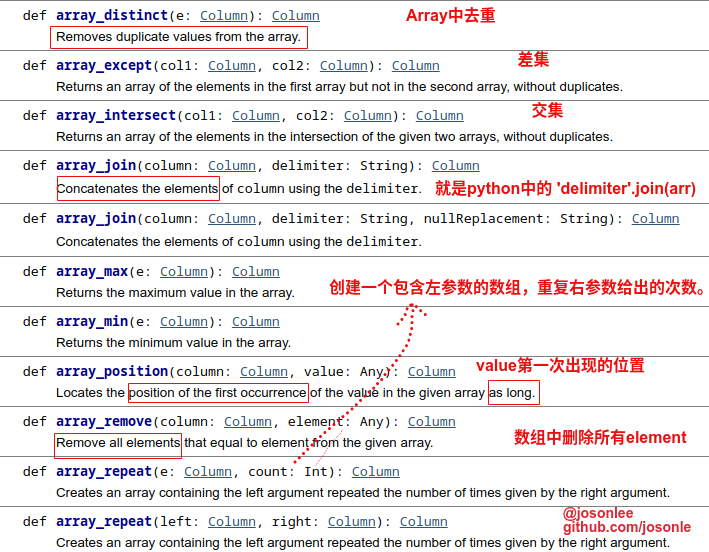
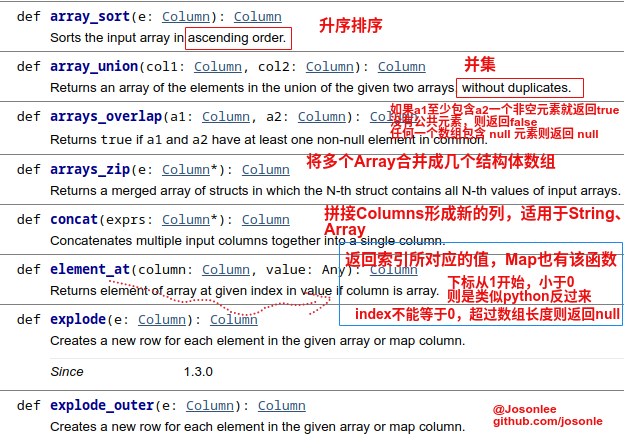
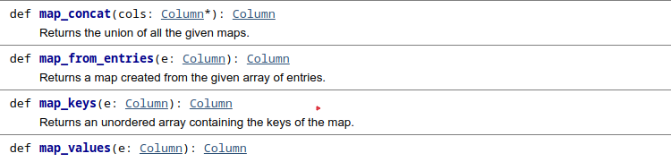
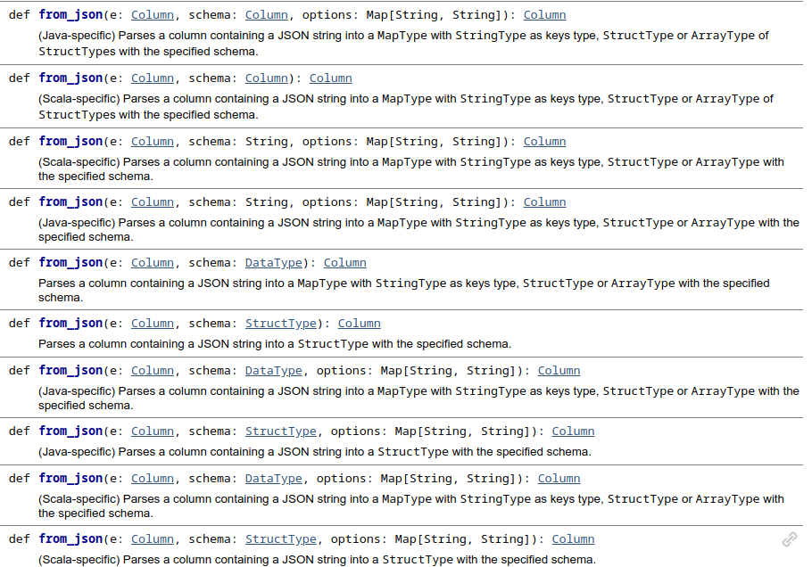
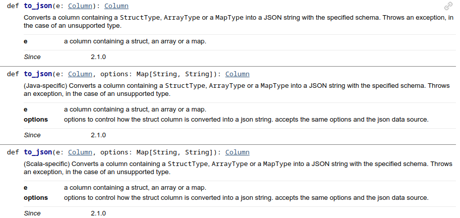
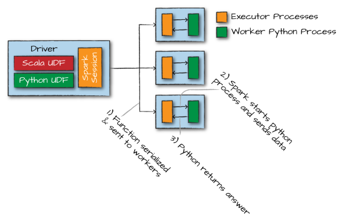

# Chapter 6：处理不同类型的数据
这一章如题所示讲的就是如何使用DataFrame相关方法处理不同类型数据，具体一点就是：布尔型、数值型、字符串、日期和时间、null、复杂的Array，Map，Struct类型、用户自定义函数

## 从哪里找到适合的方法
DataFrame（或者DataSet）的方法，因为DataFrame就是Row类型的DataSet，所以最终还是DataSet方法，去哪里找？只有官网了，[链接在此](http://spark.apache.org/docs/latest/api/scala/index.html#org.apache.spark.sql.Dataset)

DataSet又有许多子模块，像包含各种统计相关功能的DataFrameStatFunctions、处理空数据（null）的DataFrameNaFunctions

列Column相关的方法在这里：[链接在此](http://spark.apache.org/docs/latest/api/scala/index.html#org.apache.spark.sql.Column)

还有一些SQL相关的方法：[链接在此](http://spark.apache.org/docs/latest/api/scala/index.html#org.apache.spark.sql.functions$)

## 处理布尔类型数据
这次用的数据文件是`data/retail-data/by-day/2010-12-01.csv`
```scala
scala> val df = spark.read.format("csv").option("header","true").option("inferSchema","true").load("data/2010-12-01.csv")
df: org.apache.spark.sql.DataFrame = [InvoiceNo: string, StockCode: string ... 6 more fields]

scala> df.printSchema
root
 |-- InvoiceNo: string (nullable = true)
 |-- StockCode: string (nullable = true)
 |-- Description: string (nullable = true)
 |-- Quantity: integer (nullable = true)
 |-- InvoiceDate: timestamp (nullable = true)
 |-- UnitPrice: double (nullable = true)
 |-- CustomerID: double (nullable = true)
 |-- Country: string (nullable = true)
```

其实没啥好讲的，谈到布尔类型无非就是true、false、逻辑比较（等于、不等于、大于小于等）、且或非运算符这些，它们在spark中的应用如下：
```scala
# 等于
df.where(col("InvoiceNo").equalTo(536365)).show()
df.where(expr("InvoiceNo=536365")).show()
df.where("InvoiceNo=536365").show()
df.where(col("InvoiceNo")===536365).show()
# 不等于
df.where(not(col("InvoiceNo").equalTo(536365))).show()
df.where(!col("InvoiceNo").equalTo(536365)).show()
df.where(col("InvoiceNo")=!=536365).show()
df.where(expr("InvoiceNo!=536365")).show()
df.where("InvoiceNo!=536365").show()
# scala和python中还可以
df.where("InvoiceNo <> 536365").show()
```

且（and）或（or）非（not）问题，之前就提过，and连接的串行过滤器（one by one）spark也会将它们变成一个语句同时执行这些过滤器，而or连接必须写在同一个语句内，not就是取反上面代码里
```scala
val priceFilter = col("UnitPrice") > 600
val descripFilter = col("Description").contains("POSTAGE")
df.where(col("StockCode").isin("DOT")).where(priceFilter.or(descripFilter)).show()
```
布尔表达式还可用在其他地方，像新增列
```scala
val DOTCodeFilter = col("StockCode") === "DOT"
val priceFilter = col("UnitPrice") > 600
val descripFilter = col("Description").contains("POSTAGE")
df.withColumn("isExpensive", DOTCodeFilter.and(priceFilter.or(descripFilter)))
.as("isExpensive") #重命名这里没必要
.select("unitPrice", "isExpensive").show(5)

df.withColumn("isExpensive",filter.and(price.or(descript))).where("isExpensive=true").show()
```
如果比较的字段中有空（null）时，最好使用这个方法`eqNullSafe`
```scala
scala> df.where(col("Description").equalTo("LOVE BUILDING BLOCK WORD")).show
scala> df.where(col("Description").eqNullSafe("LOVE BUILDING BLOCK WORD")).show
```

> 补充记录
> - 如何去重？
> ```scala
>df.distinct() #整体去重
>df.dropDuplicates("InvoiceNo","InvoiceDate") #根据某些列去重
>```
>- 如何判断是否为空（null）？
>```scala
># 具体就是isNull、isNotNull、isNaN(这个也不能叫空)
>df.where(col("Description").isNull).show
>```
>- NaN和NULL的区别？
>null是空值，而nan是”非数字“，是无意义的数学运算的结果，像0/0这种。像spark中创建一个nan可以`float("nan")`

## 处理数值型数据
就是正常地加减乘除操作，然后就是一些函数，如pow。这里还提了两个函数，一是四舍五入的round，二是计算相关性的皮尔逊相关系数corr

> round()操作是向上四舍五入。bround()操作是向下舍去小数
> ```
> # 一个是3.0，一个是2.0
> df.select(round(lit("2.5")), bround(lit("2.5"))).show(2)
> ```

## 处理字符串型数据
就是常见的哪些字符串操作，像大小写转换，去除首尾空格，分割，取子串等等，见[链接](http://spark.apache.org/docs/latest/api/scala/index.html#org.apache.spark.sql.functions$)下的`String functions`

## 处理日期和时间型数据
打开链接搜索：[Date time functions](http://spark.apache.org/docs/latest/api/scala/index.html#org.apache.spark.sql.functions$)

## 处理 null 数据
还是回到根本，pandas中DataFrame有哪些处理null数据的方法，fillna、dropna、isNull、isNaN等等，spark sql 中也对应有相应的方法，在DataFrame的子包na下（`df.na._`）还有就是`sql.functions._`下。
像判断是否为空，前面讲了isNull（isNaN）、isNotNull方法，还有几个用于[SQL中判断null相关的方法](https://spark.apache.org/docs/2.4.0/api/sql/index.html)ifnull、nullif、nvl、nvl2方法
- `ifnull(expr1, expr2)`和`nvl(expr1, expr2)`，expr1为null则返回expr2，否则返回expr1
- `nullif(expr1, expr2) `，expr1等于expr2则返回null，否则返回expr1
- `nvl2(expr1, expr2, expr3) `，expr1为null则返回expr3，否则返回expr2

然后是drop删除包含null的行，fill填充一或多个列，[文档链接在此](https://spark.apache.org/docs/2.4.0/api/scala/index.html#org.apache.spark.sql.DataFrameNaFunctions)
```scala
# 默认删除任何值为null的行
df.na.drop() # df.na.drop("any")
df.na.drop("all") # 所有列都为null才删除
df.na.drop("all", Seq("col1","col2")) # 也可以指定特定的列
# drop也可以删除像这种低于10的
df.na.drop(10,Seq("col1","col2")) # col1、col2中值小于10的（非）
# 可以指定对于什么类型的类填充什么值
df.na.fill(5:Integer)
df.na.fill(5:Double)
# 也可以针对特定的列填充特定的值
df.na.fill(5,Seq("col1","col2")) # 当然col1是Integer类型的
df.na.fill(Map("col1"->5,"col2"->"null")) # col1填充5，col2填充"null"
```
replace也可以起到填充null的功能，像`df.na.replace(Seq("col1","col2"),Map(""->"UNKNOWN"))`，更多的是用新值替换旧值，而非替换null

还有就是Chapter 5中提及的排序时null数据是出现在前还是后asc_nulls_first、desc_nulls_first等等

这里有篇文章：[Dealing with null in Spark](https://www.mungingdata.com/apache-spark/dealing-with-null)

## 处理复杂的数据类型
这部分我感觉是绝对要掌握的，想当处第一次处理这类数据时，查资料半天费力死了。书中这一块讲的也不够，只是谈及了查询相关的处理，我额外补充吧

### 处理 Structs 的方法
这种数据结构同C语言的结构体，内部可以包含不同类型的数据。还是用上面的数据，先创建一个包含struct的DataFrame
```m
scala> val complexDF = df.selectExpr("struct(Description,InvoiceNo) as complex","Description","InvoiceNo")

scala> complexDF.printSchema
root
 |-- complex: struct (nullable = false)
 |    |-- Description: string (nullable = true)
 |    |-- InvoiceNo: string (nullable = true)
 |-- Description: string (nullable = true)
 |-- InvoiceNo: string (nullable = true)
```
包含复杂数据类型的`complexDF`和之前DataFrame都是一样使用的，区别在于如何取到结构体complex内地字段数据，有如下几种方法：
```scala
complexDF.select(col("complex").getField("Description")).show(5,false) # getField方法/getItem方法也OK，二者有区别的
complexDF.select("complex.Description").show(5,false) # 或者直接dot [`.`]，全选的话是`.*`
# sql
complexDF.createOrReplaceTempView("complex_df")
spark.sql("select complex.* from complex_df").show(5,false)
spark.sql("select complex.Description from complex_df").show(5,false)
```
### 处理 Arrays 的方法
如其名数组，和数组的性质之一一样内部只能包含同一类型的数据，先来创建一个包含Array类型的字段的DataFrame，书中这里提到了一个字符串的`split`方法，通过第二个正则参数将字符串分割，返回一个Array类型的Column
> `def
split(str: Column, pattern: String): Column` , Splits str around pattern (pattern is a regular expression).

```scala
# scala
scala> import org.apache.spark.sql.functions.split
import org.apache.spark.sql.functions.split
# 将Description通过空格分割
scala> df.select(split(col("Description")," ")).printSchema
root
 |-- split(Description,  ): array (nullable = true)
 |    |-- element: string (containsNull = true)
scala> df.select(split(col("Description")," ")).show(2)
+---------------------+
|split(Description,  )|
+---------------------+
| [WHITE, HANGING, ...|
| [WHITE, METAL, LA...|
+---------------------+

# SQL做法，SELECT split(Description, ' ') FROM dfTable
```
Spark可以将这类复杂数据类型转为另一列，并可以通过一种类似Python操作数组的方式进行查询该数组
```scala
scala> df.select(split(col("Description")," ").alias("array_col")).select(expr("array_col[0]")).show(2)
+------------+
|array_col[0]|
+------------+
|       WHITE|
|       WHITE|
+------------+

# sql写法，SELECT split(Description, ' ')[0] FROM dfTable

# 当然还可以用getItem
scala> df.select(split(col("Description")," ").alias("array_col")).select(col("array_col").getItem(0)).show(2)
```

获取数组的长度可以使用`size`方法（也适合于Map）
> `def
size(e: Column): Column` , Returns length of array or map.

```scala
scala> import org.apache.spark.sql.functions.size
import org.apache.spark.sql.functions.size
# 我这里Column是用$方式写的
scala> df.select(split($"Description", " ").alias("array_col")).withColumn("no_of_array",size($"array_col")).show(2,false)
+----------------------------------------+-----------+
|array_col                               |no_of_array|
+----------------------------------------+-----------+
|[WHITE, HANGING, HEART, T-LIGHT, HOLDER]|5          |
|[WHITE, METAL, LANTERN]                 |3          |
+----------------------------------------+-----------+
```

判断Array中是否包含某个元素可以用`array_contains`方法
> `def
array_contains(column: Column, value: Any): Column` , Returns null if the array is null, true if the array contains value, and false otherwise.

多用来做where条件的判断

```scala
scala> import org.apache.spark.sql.functions.array_contains
import org.apache.spark.sql.functions.array_contains

scala> df.select(split(col("Description"), " ").alias("array_col")).withColumn("contains_WHITE",array_contains($"array_col","WHITE")).show(5,false)
+------------------------------------------+--------------+
|array_col                                 |contains_WHITE|
+------------------------------------------+--------------+
|[WHITE, HANGING, HEART, T-LIGHT, HOLDER]  |true          |
|[WHITE, METAL, LANTERN]                   |true          |
|[CREAM, CUPID, HEARTS, COAT, HANGER]      |false         |
|[KNITTED, UNION, FLAG, HOT, WATER, BOTTLE]|false         |
|[RED, WOOLLY, HOTTIE, WHITE, HEART.]      |true          |
+------------------------------------------+--------------+

# sql中一样的
scala> val df1 = df.select(split(col("Description"), " ").alias("array_col"))
df1: org.apache.spark.sql.DataFrame = [array_col: array<string>]
scala> df1.createOrReplaceTempView("array_df")

scala> spark.sql("select *, array_contains(array_col,'WHITE') from array_df").show(5,false)
+------------------------------------------+--------------------------------+
|array_col                                 |array_contains(array_col, WHITE)|
+------------------------------------------+--------------------------------+
|[WHITE, HANGING, HEART, T-LIGHT, HOLDER]  |true                            |
|[WHITE, METAL, LANTERN]                   |true                            |
|[CREAM, CUPID, HEARTS, COAT, HANGER]      |false                           |
|[KNITTED, UNION, FLAG, HOT, WATER, BOTTLE]|false                           |
|[RED, WOOLLY, HOTTIE, WHITE, HEART.]      |true                            |
+------------------------------------------+--------------------------------+
# 多还是用来作为where条件的判断，这里随便举个例子
val df2 = df.select(split(col("Description"), " ").alias("array_col")).withColumn("item",$"array_col".getItem(0))
# 第二个参数也能传Column，判断是否包含对应位置的元素
df2.where("array_contains(array_col,item)").show(2) # 这样写实际是expr
df2.where(array_contains($"array_col",$"item")).show(2)
```
> 值得注意的是，SQL中Column的写法，**不要带上引号**，带了引号就看成String处理，写着容易忘

还可以使用`explode`方法将复杂的数据类型转为一组rows（就是Array/Map中每个元素展开对应其他列形成新列），如下图
> `def
explode(e: Column): Column`, Creates a new row for each element in the given array or map column.


```scala
scala> import org.apache.spark.sql.functions.explode
scala> df.withColumn("splitted", split(col("Description"), " "))
  .withColumn("exploded", explode(col("splitted")))
  .select("Description", "InvoiceNo", "exploded").show(2)
+--------------------+---------+--------+
|         Description|InvoiceNo|exploded|
+--------------------+---------+--------+
|WHITE HANGING HEA...|   536365|   WHITE|
|WHITE HANGING HEA...|   536365| HANGING|
+--------------------+---------+--------+

# 我这里写了个简单点的
scala> val df4 = Seq((Seq(1,1,2),2),(Seq(1,2,3),3)).toDF("item","id")
df4: org.apache.spark.sql.DataFrame = [item: array<int>, id: int]

scala> df4.printSchema
root
 |-- item: array (nullable = true)
 |    |-- element: integer (containsNull = false)
 |-- id: integer (nullable = false)

scala> df4.show()
+---------+---+
|     item| id|
+---------+---+
|[1, 1, 2]|  2|
|[1, 2, 3]|  3|
+---------+---+
# 就是展开了Array，然后对应其他列构成新的列
scala> df4.withColumn("exploded",explode($"item")).show
+---------+---+--------+
|     item| id|exploded|
+---------+---+--------+
|[1, 1, 2]|  2|       1|
|[1, 1, 2]|  2|       1|
|[1, 1, 2]|  2|       2|
|[1, 2, 3]|  3|       1|
|[1, 2, 3]|  3|       2|
|[1, 2, 3]|  3|       3|
+---------+---+--------+
```


补充下图片，可能说的不详细
- `explode_outer`，同`explode`，但当array或map为空或null时，会展开为null
- `arrays_overlap(a1,a2)`
  - 数组a1至少包含数组a2的一个非空元素，则返回true
  - 任何数组包含null，则返回null
```
spark.sql("select arrays_overlap(array(1,2,3),array(3,4,5))").show
true
spark.sql("select arrays_overlap(array(1,2,3),array(4,5))").show
false
spark.sql("select arrays_overlap(array(1,2,3),array(4,5,null))").show
null
```

- `arrays_zip(array<T>, array<U>, ...):array<struct<T, U, ...>>`
  - 合并n个Array为结构数组
  - 第n个结构（struct）包含所有输入Array的第n个值，没有即为null

```scala
scala> val df = spark.sql("select arrays_zip(array(1,2,3),array('4','5')) as array_zip")
scala> df.printSchema
root
 |-- array_zip: array (nullable = false)
 |    |-- element: struct (containsNull = false)
 |    |    |-- 0: integer (nullable = true)
 |    |    |-- 1: string (nullable = true)
scala> df.select(col("array_zip").getItem(0)).show
+------------+
|array_zip[0]|
+------------+
|      [1, 4]|
+------------+
```
- `element_at(array<T>, Int):T`和`element_at(map<K, V>, K):V` 
  - 也适合Map，返回key对应的value，不含key的话返回null

```scala
scala> spark.sql("select element_at(array(1,2,3),-1)").show
+------------------------------+
|element_at(array(1, 2, 3), -1)|
+------------------------------+
|                             3|
+------------------------------+
scala> spark.sql("select element_at(array(1,2,3),4)").show
+-----------------------------+
|element_at(array(1, 2, 3), 4)|
+-----------------------------+
|                         null|
+-----------------------------+
scala> spark.sql("select element_at(array(1,2,3),0)").show
java.lang.ArrayIndexOutOfBoundsException: SQL array indices start at 1
```

还有一些适用于Array的方法，不好截图，列在这里：
- `reverse(e: Column): Column`，将字符串或者数组元素翻转
  - **注意：像字符串"abc def"翻转过来是"fed cba"**
- `flatten(array<array<T>>): array<T>`，把嵌套数组转换为数组，但如果嵌套数组的结构层级超过2，也只是去掉一层嵌套
```scala
spark.sql("select flatten(array(array(1,2),array(3,4)))").show
[1, 2, 3, 4]

spark.sql("select flatten(array(array(array(1,2),array(3,4)),array(array(5,6))))").show(false)
[[1, 2], [3, 4], [5, 6]] 
```
- `shuffle(e: Column): Column`，把数组随机打乱排列
- `slice(x: Column, start: Int, length: Int): Column`，就是截取数组，类似python，但这里是把数组x从索引start开始截取length个元素的数组返回
  - 如果**start是负数**，则**从末尾开始向后截取**，貌似没解释清，看示例
  - **索引从1开始**
```scala
scala> spark.sql("select slice(array(1,2,3),1,2)").show
+---------------------------+
|slice(array(1, 2, 3), 1, 2)|
+---------------------------+
|                     [1, 2]|
+---------------------------+
scala> spark.sql("select slice(array(1,2,3),-2,2)").show # slice(array(1,2,3),-2,3)也是返回这个，length超过数组长也只是返回xxx。。。，就这个意思，我叙述不清
+----------------------------+
|slice(array(1, 2, 3), -2, 2)|
+----------------------------+
|                      [2, 3]|
+----------------------------+
```
- `sort_array(e: Column, asc: Boolean): Column`，也是数组排序，不同于上图中的是**可以指定升降序**

### 处理 Maps 的方法
Map就是key-value对格式的数据，spark sql提供一个`map`方法可以将两个Column转为Map Column，**key不能为null**，value可以
```scala
scala> df.select(map(col("Description"),col("InvoiceNo")).alias("complex_map")).show(2,false)
+----------------------------------------------+
|complex_map                                   |
+----------------------------------------------+
|[WHITE HANGING HEART T-LIGHT HOLDER -> 536365]|
|[WHITE METAL LANTERN -> 536365]               |
+----------------------------------------------+

# SQL写法，SELECT map(Description, InvoiceNo) as complex_map FROM dfTable
WHERE Description IS NOT NULL
```

可以像python中使用字典一样进行查询
```scala
scala> val df1 = df.select(map(col("Description"), col("InvoiceNo")).alias("complex_map"))

scala> df1.printSchema
root
 |-- complex_map: map (nullable = false)
 |    |-- key: string
 |    |-- value: string (valueContainsNull = true)
 
scala> df1.select(expr("complex_map['WHITE METAL LANTERN']")).show(2)
+--------------------------------+
|complex_map[WHITE METAL LANTERN]|
+--------------------------------+
|                            null|
|                          536365|
+--------------------------------+
```
前面提到的`explode`方法作用于Map
```scala
scala> df1.select($"complex_map",explode($"complex_map")).show(5,false)
+-----------------------------------------------+-----------------------------------+------+
|complex_map                                    |key                                |value |
+-----------------------------------------------+-----------------------------------+------+
|[WHITE HANGING HEART T-LIGHT HOLDER -> 536365] |WHITE HANGING HEART T-LIGHT HOLDER |536365|
|[WHITE METAL LANTERN -> 536365]                |WHITE METAL LANTERN                |536365|
|[CREAM CUPID HEARTS COAT HANGER -> 536365]     |CREAM CUPID HEARTS COAT HANGER     |536365|
|[KNITTED UNION FLAG HOT WATER BOTTLE -> 536365]|KNITTED UNION FLAG HOT WATER BOTTLE|536365|
|[RED WOOLLY HOTTIE WHITE HEART. -> 536365]     |RED WOOLLY HOTTIE WHITE HEART.     |536365|
+-----------------------------------------------+-----------------------------------+------+
```

- `map_form_arrays(array<K>, array<V>): map<K, V>`，将给的数组组合成一个Map，**key数组一定不能包含null**



- `map_from_entries(array<struct<K, V>>): map<K, V>`，从给定的结构体数组返回一个Map
- `map_concat(map<K, V>, ...): map<K, V>`，返回多个Map的并集
- `map_keys/values`，数组形式返回Map列对应key/value
- 还有就是上面提过的`element_at`


```scala
scala> val df2 = spark.sql("SELECT map(1, 'a', 2, 'b') as aMap, map(2, 'c', 3, 'd') as bMap")
scala> df2.printSchema # 进一步说明key不能为null
root
 |-- aMap: map (nullable = false)
 |    |-- key: integer
 |    |-- value: string (valueContainsNull = false)
 |-- bMap: map (nullable = false)
 |    |-- key: integer
 |    |-- value: string (valueContainsNull = false)
scala> df2.select(map_concat($"aMap",$"bMap")).show(false)
+--------------------------------+
|map_concat(aMap, bMap)          |
+--------------------------------+
|[1 -> a, 2 -> b, 2 -> c, 3 -> d]|
+--------------------------------+
# keys
scala> df2.select(map_keys($"aMap")).show
+--------------+
|map_keys(aMap)|
+--------------+
|        [1, 2]|
+--------------+
# values
scala> df2.select(map_values($"aMap")).show
+----------------+
|map_values(aMap)|
+----------------+
|          [a, b]|
+----------------+
# map_keys($"aMap")(0)返回的是1
scala> df2.select(element_at($"aMap",map_keys($"aMap")(0))).show
+-----------------------------------+
|element_at(aMap, map_keys(aMap)[0])|
+-----------------------------------+
|                                  a|
+-----------------------------------+
```

### 处理 JSON 的方法
JSON格式的数据是很常见的，Spark也提供了系列方法来解析或者提取JSON对象，但有一点要知道，这种格式的数据是以字符串形式存储的，没有什么JSON类型


- `get_json_object(e: Column, path: String): Column`，从json字符串中根据给定的json路径提取一个json对象
  - e是json格式的字符串也可以，`spark.sql("""select get_json_object('{"key1":{"key2":[1,2,3]}}','$.key1.key2')""")`，了解就好
- `json_tuple(json: Column, fields: String*): Column`，如果json字符串只有一个层级，可以使用该方法提取json对象
- `from_json`，根据给定的Schema将json字符串的Column列解析成对应列
- `to_json`，将多个列转成json字符串的列

先创建一个包含json类型字符串列的df
```scala
# spark.range(1)是为了创建一个df
# 直接spark.sql("""select '{"myJSONKey" : {"myJSONValue" : [1, 2, 3]}}' as jsonString""") 也是OK的
scala> val jsonDF = spark.range(1).selectExpr("""'{"myJSONKey" : {"myJSONValue" : [1, 2, 3]}}' as jsonString""")
jsonDF: org.apache.spark.sql.DataFrame = [jsonString: string]
# jsonString是string类型
scala> jsonDF.show(false)
+-------------------------------------------+
|jsonString                                 |
+-------------------------------------------+
|{"myJSONKey" : {"myJSONValue" : [1, 2, 3]}}|
+-------------------------------------------+
```

看下get_json_object和json_tuple的用法
```scala
scala> jsonDF.select(get_json_object($"jsonString","$.myJSONKey")).show(false)
# 输出{"myJSONValue":[1,2,3]} 
scala> jsonDF.select(get_json_object($"jsonString","$.myJSONKey.myJSONValue")).show(false)
# 输出[1,2,3] ,还是字符串，不是什么Array
scala> jsonDF.select(get_json_object($"jsonString","$.myJSONKey.myJSONValue[0]")).show(false)
# 输出1
scala> jsonDF.select(json_tuple($"jsonString","myJSONKey")).show
# 输出{"myJSONValue":[1,2,3]}
# 无法解析更深的层次，即提不出myJSONValue对应的
# 但json_tuple可以同时提取多个json对象出来
# 这里再创建一个
scala> val test = spark.sql("""select '{"key" : "value","key2" : "value2"}' as jsonString""")

scala> test.select(json_tuple($"jsonString","key","key2")).show
+-----+------+
|   c0|    c1|
+-----+------+
|value|value2|
+-----+------+
```

然后看下from_json和to_json方法，这两方法有多个重载，选择适合的用吧



```scala
# 创建一个df，json_col对应的就是json字符串
scala> val df = Seq (
  (0, """{"device_id": 0, "device_type": "sensor-ipad", "ip": "68.161.225.1", "cn": "United States", "timestamp" :1475600496 }"""),
  (1, """{"device_id": 1, "device_type": "sensor-igauge", "ip": "213.161.254.1", "cn": "Norway", "timestamp" :1475600498 }""")).toDF("id","json_col")
df: org.apache.spark.sql.DataFrame = [id: int, json_col: string]
# 对应创建一个schema，可以mySchema.treeString查看
scala> val mySchema = new StructType().add("device_id",IntegerType).add("device_type",StringType).add("ip",StringType).add("cn",StringType).add("timestamp",TimestampType)

# from_json简单使用，会解析成一个Struct类型的列col（数据类型一样的话也可以是Array类型）
# 可以查看col的Schema，所以可以根据col.*查询全部，也可以col.属性查询特定属性
scala> df.select(from_json($"json_col",mySchema) as "col").select(expr("col.*")).show
+---------+-------------+-------------+-------------+-------------------+
|device_id|  device_type|           ip|           cn|          timestamp|
+---------+-------------+-------------+-------------+-------------------+
|        0|  sensor-ipad| 68.161.225.1|United States|2016-10-05 01:01:36|
|        1|sensor-igauge|213.161.254.1|       Norway|2016-10-05 01:01:38|
+---------+-------------+-------------+-------------+-------------------+
scala> df.select(from_json($"json_col",mySchema) as "col").select($"col.*").where($"col.cn"==="Norway").show
+---------+-------------+-------------+------+-------------------+
|device_id|  device_type|           ip|    cn|          timestamp|
+---------+-------------+-------------+------+-------------------+
|        1|sensor-igauge|213.161.254.1|Norway|2016-10-05 01:01:38|
+---------+-------------+-------------+------+-------------------+
```

从文档可以看出`to_json`是把一个包含StructType，ArrayType或MapType的列转换为具有指定模式（类型中推出）的JSON字符串列，所以要先把要转换的列封装成StructType，ArrayType或MapType格式
```scala
# to_json 简单使用
scala> val df1 = df.select(from_json($"json_col",mySchema) as "col").select($"col.*")
# df1.printSchema
# 再把device_id、ip、timestamp 三列转为json字符串列
# 如果是所有列的化，这样写struct($"*")
scala> df1.select(to_json(struct($"device_id",$"ip"，$"timestamp")).alias("json_col")).show(false)
+--------------------------------------------------------------------------------+
|json_col                                                                        |
+--------------------------------------------------------------------------------+
|{"device_id":0,"ip":"68.161.225.1","timestamp":"2016-10-05T01:01:36.000+08:00"} |
|{"device_id":1,"ip":"213.161.254.1","timestamp":"2016-10-05T01:01:38.000+08:00"}|
+--------------------------------------------------------------------------------+
```

## 自定义函数（UDF）使用
Spark 最强的功能之一就是定义你自己的函数（UDFs），使得你可以通过Scala、Python或者使用外部的库（libraries）来得到你自己需要的transformation操作。UDFs可以输入、返回一个或多个Column。其次Spark UDF强大在于，你可以用多种不同的编程语言编写它们，但不需要以深奥的格式或特定于域的语言创建它们，它们只是对数据进行操作、记录。默认情况是将这些UDFs注册为临时函数用在特定的SparkSession、Context下，即按需创建使用

尽管你可以使用Scala、Python或者Java来编写UDFs，但你还是要注意一些性能方面的影响。为了说明这些，接下来会直接告诉你当你创建UDF时发生了什么，然后在Spark上使用创建的UDF执行代码

首先是实际的函数，这里会创建一个简单的求解数的立方的函数`power3`
```scala
val df = spark.range(5)
def power3(number:Double):Double = number*number*number
```
`power3`还有要求是不能输入空值

好了现在需要测试这个函数，我们需要在Spark中注册它们，以便我们可以在所有工作机器上使用它们。Spark 会在Driver驱动程序上序列化该函数，并跨网络分发到所有的Executor进程上去。当然这些和语言无关的

当你使用这个函数时，还会出现两种不同的情况。如果这个函数是用Scala、Java写的，你可以在JVM中使用它。这意味着你除了无法利用 Spark 对内置函数的代码生成功能，几乎没有性能损失。但当你创建或使用大量的对象时，可能会出现性能问题，Chapter 19会将这些的优化。如果这个函数使用Python编写，会有不同之处。Spark 会在 Worker 上启动一个 Python 进程，然后使用 Python 可以理解的格式去序列化所有数据（这些数据之前在 JVM 上），再一行一行的在数据上用 Python 进程去执行该函数，最后返回所有行的执行结果给 JVM 和 Spark 。下图反映了这个过程

这是因为 Spark 是用 Scala 写的，而 Scala 本源就是 Java，所以启动的 Executor 进程就是 Java 进程。

> **注意：**
> 启动这个 Python 进程的成本高，但实际成本是将数据序列化为 Python 可以处理的格式的过程。因为这是一个高成本的计算，而且数据进入 Python 之后，就是 Python 进程说的算，Spark 无法管理 Worker 的内存。如果 Worker 的资源受限制，Worker 就会失败。因为Java 进程（JVM）会和 Python 进程在同一机器上竞争内存资源。
> 作者是建议使用Scala来编写函数，我也认可，Scala 学精了真的是写起来省时省力，就是不注释好的话后期不好理解。当然，也可以用 Python 来写的

这上面就是创建的整个过程，然后就是注册这个函数，使它可用于 DataFrame
```scala
import org.apache.spark.sql.functions.udf
# 直接这样 udf(power3 _) 就行了
val power3udf = udf(power3(_:Double):Double)
```
然后就可以像其他 DataFrame 方法一样使用它
```scala
scala> df.select(power3udf($"num")).show
+--------+
|UDF(num)|
+--------+
|     0.0|
|     1.0|
|     8.0|
|    27.0|
|    64.0|
+--------+
```
但这还只是可以用作 DataFrame 上的方法，只能在表达式中使用它，而不能在字符串表达式中使用它，迷糊吧，看下面的报错，什么是不能在字符串表达式中使用它
```scala
scala> df.selectExpr("power3udf(num)").show
org.apache.spark.sql.AnalysisException: Undefined function: 'power3udf'. This function is neither a registered temporary function nor a permanent function registered in the database 'default'.; line 1 pos 0
```

所以，还要把它注册为 Spark SQL 的函数，才能方便地使用
```scala
# spark 2.x 
spark.udf.register("power3",power3 _)
# spark 1.x 使用，sqlContext.udf.register("power3",power3 _)
# 再次查询
scala> df.selectExpr("power3(num)").show
+-------------------------------+
|UDF:power3(cast(num as double))|
+-------------------------------+
|                            0.0|
|                            1.0|
|                            8.0|
|                           27.0|
|                           64.0|
+-------------------------------+
```
可以看出这两个`udf`虽然同名但是是不同类的方法，反正看情况吧，我测试发现要是注册为 Spark SQL 的方法也不能直接用在 DataFrame 表达式操作上。